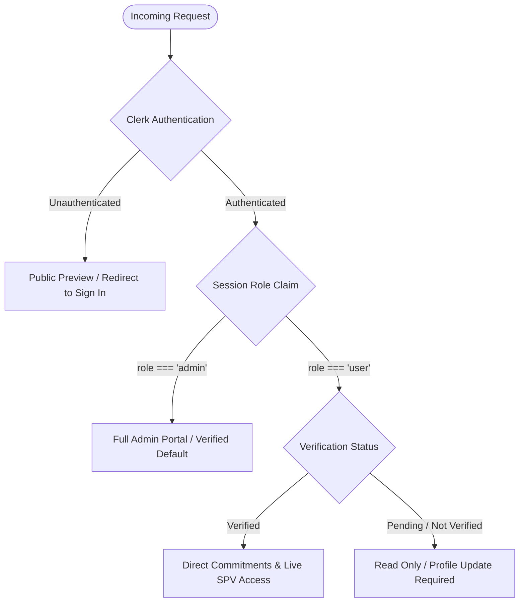
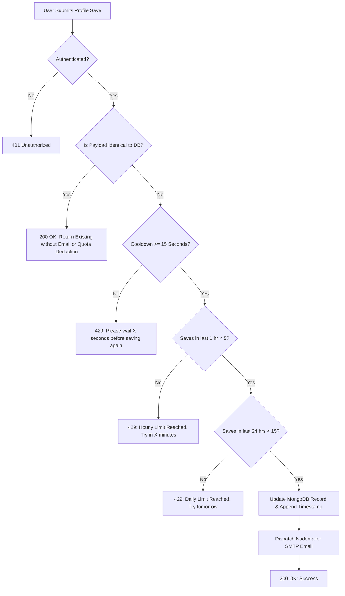

# Apex Krish Capital — System Architecture & Technical Documentation

**Version:** 2.4.0  
**Status:** Production Ready  
**Target Audience:** Engineering, Product, Security & Operations  
**Last Updated:** September 2026  

---

## Table of Contents

1. [Executive Summary & Platform Purpose](#1-executive-summary--platform-purpose)
2. [Technology Stack & System Topology](#2-technology-stack--system-topology)
3. [Architecture Overview & Project Structure](#3-architecture-overview--project-structure)
4. [Data Models & Schema Specifications](#4-data-models--schema-specifications)
5. [Authentication, Authorization & Role-Based Access Control (RBAC)](#5-authentication-authorization--role-based-access-control-rbac)
6. [Core Functional Modules & Features](#6-core-functional-modules--features)
   - [6.1 Landing Page & Conversion Architecture](#61-landing-page--conversion-architecture)
   - [6.2 Deal Syndication & Offerings Engine](#62-deal-syndication--offerings-engine)
   - [6.3 Investor Profile Lifecycle](#63-investor-profile-lifecycle)
   - [6.4 Administrative Operations & Deal Room](#64-administrative-operations--deal-room)
7. [API Route Specifications & Endpoints](#7-api-route-specifications--endpoints)
8. [Security, Rate Limiting & Anti-Spam Protections](#8-security-rate-limiting--anti-spam-protections)
9. [Email Dispatch Subsystem (SMTP / Nodemailer)](#9-email-dispatch-subsystem-smtp--nodemailer)
10. [Design System & Anti-Slop Architectural Standard](#10-design-system--anti-slop-architectural-standard)
11. [Deployment & Environment Configuration](#11-deployment--environment-configuration)

---

## 1. Executive Summary & Platform Purpose

**Apex Krish Capital** is a private market syndication platform engineered to connect verified, high-net-worth accredited investors with direct Special Purpose Vehicle (SPV) allocations into tier-one frontier technology companies (e.g., Micro1 Inc., Scale AI, xAI, Neuralink).

### Core Value Proposition
- **Institutional Access, Founder-Friendly Economics:** Traditional private equity and venture syndicates charge carry fees in excess of 20% on net profits. Apex Krish Capital operates on a streamlined **10% performance carry structure** (half the industry average).
- **506(c) Compliance Workflow:** Frictionless qualification, investor self-certification, administrator verification, and audit trails.
- **Precision Deal Commitment Engine:** Real-time allocation caps, minimum check sizes ($5,000 USD), binding intent capture, and instant administrative lead routing.

---

## 2. Technology Stack & System Topology

| Layer | Technology | Rationale & Implementation Details |
| :--- | :--- | :--- |
| **Framework** | Next.js 15+ (App Router) | Server-side rendering (SSR), streaming client hydration, high-performance edge routing. |
| **Language** | TypeScript 5+ | End-to-end type safety across schemas, API payloads, and component props. |
| **Styling & UI** | Tailwind CSS + Radix UI (Shadcn) | Architectural minimalist design system, zero runtime CSS overhead, accessible primitives. |
| **Authentication** | Clerk Auth | Multi-session handling, OAuth 2.0 (Google), session claims, metadata-driven RBAC. |
| **Database** | MongoDB (Mongoose ODM) | Document-oriented persistence with schema validation, indexes, and aggregation pipelines. |
| **Email Subsystem**| Nodemailer (SMTP) | Multi-part HTML notification emails with embedded CID brand assets and fail-safe error handling. |
| **Icons** | Lucide React | High-contrast geometric iconography. |

---

## 3. Architecture Overview & Project Structure

```
my-app/
├── app/
│   ├── layout.tsx                # Global Root Layout (ClerkProvider, Theme, Fonts, Navbar)
│   ├── page.tsx                  # Public Landing Page (Hero, Offerings, Sector Thesis, Fiduciary)
│   ├── aboutus/page.tsx          # Institutional About Us & Team Thesis
│   ├── profile/page.tsx          # Protected Investor Profile Management Route
│   ├── admin/page.tsx            # Protected Administrative Operations Portal
│   ├── api/
│   │   ├── user/
│   │   │   └── profile/route.ts  # GET/POST: Profile sync, rate limiting & Nodemailer triggers
│   │   ├── offerings/
│   │   │   ├── interact/route.ts # POST: Intent & capital commitments capture
│   │   │   └── my-interactions/  # GET: Authenticated user allocation status
│   │   └── admin/
│   │       ├── users/route.ts    # GET/PATCH: Investor roster & verification status
│   │       └── commitments/      # GET: Syndicate commitments aggregation
├── components/
│   ├── navbar.tsx                # Context-aware navigation with dynamic authentication states
│   ├── HeroSection.tsx           # High-conversion hero with 10% carry value proposition
│   ├── OfferingsSection.tsx      # Current deal room, past track record, and commit modal
│   ├── ProfileComponent.tsx      # Interactive investor profile form with accreditation tooltips
│   ├── AdminPage.tsx             # Dual-tab admin dashboard (Investors & Commitments)
│   └── ui/                       # Shadcn UI accessible primitives (button, select, etc.)
├── models/
│   ├── user.model.ts             # MongoDB User schema with anti-spam timestamps & roles
│   └── commitment.model.ts       # MongoDB Commitment schema tracking dollar checks
├── lib/
│   ├── dbConnect.ts              # Cached MongoDB connection manager
│   ├── email.ts                  # Nodemailer SMTP transport & template compiler
│   └── utils.ts                  # Tailwind class merger (clsx + twMerge)
└── public/                       # Static brand assets (apexkrishnalogo.png, usericon.webp)
```

---

## 4. Data Models & Schema Specifications

### 4.1 User Document Model (`models/user.model.ts`)

Represents individual investor accounts, administrative privileges, accreditation qualification, and anti-abuse audit trails.

```typescript
export interface IUser {
  email: string;
  name?: string;
  firstName?: string;
  middleName?: string;
  lastName?: string;
  role?: "user" | "admin";
  phoneNumber?: string;
  avatar?: string;
  investorStatus?: 
    | "Not Accredited"
    | "Accredited investor(1M+)"
    | "Qualified client(2M+)"
    | "Qualified purchaser(5M+)"
    | string;
  citizenship?: "US" | "Non-US" | string;
  verificationStatus?: 
    | "pending verification"
    | "verified"
    | "not verified"
    | "yet to be verified"
    | string;
  profileUpdateHistory?: Date[];
  lastProfileUpdateAt?: Date;
  createdAt?: Date;
  updatedAt?: Date;
}
```

#### Key Schema Behaviors & Hooks
- **Automated Admin Verification**: Mongoose `pre('save')` hook guarantees any user with `role: "admin"` is automatically marked as `verificationStatus: "verified"`.
- **Hot-Reload Schema Mutation Safety**: Dev-mode cache eviction automatically cleans stale Mongoose models when fields are introduced.

---

### 4.2 Commitment Document Model (`models/commitment.model.ts`)

Represents allocation requests and expressions of interest in specific syndicate deals.

```typescript
export interface ICommitment {
  userId: mongoose.Types.ObjectId | string;
  offeringId: string;           // e.g. "micro1-inc"
  offeringTitle: string;        // e.g. "Micro1 Inc."
  type: "interest" | "commitment";
  amount?: number | null;       // USD check amount (minimum $5,000 for commitments)
  status: "pending" | "approved" | "rejected" | "allocated";
  notes?: string;
  createdAt?: Date;
  updatedAt?: Date;
}
```

---

## 5. Authentication, Authorization & Role-Based Access Control (RBAC)

The system leverages **Clerk Authentication** with customized session claim synchronization:



### Authorization Levels
1. **Public / Unauthenticated**: Can view high-level thesis, active offering metadata, and past deals. Cannot commit capital or express formal interest.
2. **Authenticated (Pending / Unverified)**: Can save and update investor credentials. Deal room indicates review status.
3. **Authenticated (Verified Investor)**: Fully unlocked. Can formalize dollar check commitments ($5K+) and express priority deal interest.
4. **Platform Administrator**: Access to `/admin` dashboard. Can inspect all investor phone numbers, update verification statuses in real-time, and manage capital commitment queues.

---

## 6. Core Functional Modules & Features

### 6.1 Landing Page & Conversion Architecture

1. **Hero Section (`components/HeroSection.tsx`)**:
   - Engineered for institutional conversion based on high-performing private equity references.
   - Prominently showcases the **10% performance carry structure vs. 20%+ industry standard**.
   - Live syndicate indicators and dynamic CTAs linked to profile completion.
2. **Sector Index (`app/page.tsx`)**:
   - Three key pillars: **Intelligence & Autonomous Agents**, **Hardware & Scale**, and **Bio-Computation & Frontier Platforms**.
3. **Fiduciary & SPV Terms**:
   - Outlines Delaware Series LLC SPV structures, custody mechanics, K-1 tax distributions, and accredited compliance under Rule 506(c) of Regulation D.

---

### 6.2 Deal Syndication & Offerings Engine (`components/OfferingsSection.tsx`)

- **Active Offering**: **Micro1 Inc. SPV Series**
  - Valuation: **$3.7B Pre-money**
  - Syndicate Allocation Cap: **$125,000 USD**
  - Minimum Check Size: **$5,000 USD**
  - Round Status: Direct SPV Secondary Equity
- **Interactive Action States**:
  - **Unauthenticated**: "Log in to participate" CTA.
  - **Verification Pending**: Shows administrator review notice with direct profile link.
  - **Verified Investor**:
    - **"Commit Capital" / "Update Commitment"**: Opens commitment modal. Automatically pre-fills existing commitment amounts for returning investors.
    - **"I'm Interested"**: One-click non-binding priority queue enrollment.
- **Past Track Record**: Historical distributed SPVs in **Scale AI (Series F)**, **xAI (Series B)**, and **Neuralink (Direct SPV)**.
- **UI Overflow Prevention**: Action buttons utilize full-width vertical stacking with dedicated icon markers to eliminate horizontal text clipping across mobile and tablet viewports.

---

### 6.3 Investor Profile Lifecycle (`components/ProfileComponent.tsx`)

- **Complete Qualification Data**: Captures First Name, Middle Name, Last Name, Phone Number, Accredited Status, Citizenship, and Avatar.
- **Accreditation Definitions Tooltip**: Floating desktop/mobile portal displaying precise SEC definitions for *Accredited Investor ($1M+)*, *Qualified Client ($2M+)*, and *Qualified Purchaser ($5M+)* on hover/touch.
- **Client-Side Anti-Spam UX**: Save button disables upon save to prevent duplicate clicks and shows clear success feedback.

---

### 6.4 Administrative Operations & Deal Room (`components/AdminPage.tsx`)

Dual-tab operational suite built exclusively for syndicate managers:

```
┌────────────────────────────────────────────────────────────────────────┐
│  APEX KRISH CAPITAL — SYNDICATE OPERATIONS DESK                        │
├────────────────────────────────────────────────────────────────────────┤
│  [ Registered Investors (Tab 1) ]    [ Deal Commitments (Tab 2) ]     │
├────────────────────────────────────────────────────────────────────────┤
│  • Investor Directory with Phone Numbers, Email, Accreditation Status  │
│  • Inline Verification Status Switcher (Pending / Verified / Rejected)  │
│  • Live Aggregate Pipeline ($ Amount Committed, Total Investor Count)  │
│  • Direct Contact Export for Wire Instructions & Subscription Packets  │
└────────────────────────────────────────────────────────────────────────┘
```

---

## 7. API Route Specifications & Endpoints

### 7.1 `/api/user/profile`

- **Methods**: `GET`, `POST`
- **Authentication**: Required (Clerk `currentUser()`)
- **GET Response**: Returns user database record and Clerk identity metadata.
- **POST Request Body**:
  ```json
  {
    "firstName": "Partha",
    "middleName": "S.",
    "lastName": "Suresh",
    "phone": "+1 555 0199",
    "investorStatus": "Accredited investor(1M+)",
    "citizenship": "US",
    "avatar": "https://..."
  }
  ```
- **Protections**: Rate-limited, payload deduplication check, automated Nodemailer trigger.

---

### 7.2 `/api/offerings/interact`

- **Methods**: `POST`
- **Authentication**: Required (Must be verified 506(c) investor)
- **POST Request Body**:
  ```json
  {
    "offeringId": "micro1-inc",
    "type": "commitment",
    "amount": 25000
  }
  ```
- **Validation**: Enforces `$5,000 USD` minimum check constraint on commitments.

---

### 7.3 `/api/offerings/my-interactions`

- **Methods**: `GET`
- **Authentication**: Optional / Contextual
- **Response**: Returns `isSignedIn`, `verificationStatus`, and dictionary of user interaction records.

---

### 7.4 `/api/admin/users`

- **Methods**: `GET`, `PATCH`
- **Authentication**: Required (`role === 'admin'`)
- **GET Response**: Full investor list with populated `phoneNumber` and `verificationStatus`.
- **PATCH Request Body**:
  ```json
  {
    "userId": "66ed84...",
    "verificationStatus": "verified"
  }
  ```

---

### 7.5 `/api/admin/commitments`

- **Methods**: `GET`
- **Authentication**: Required (`role === 'admin'`)
- **GET Response**: All deal commitments and interest expressions populated with investor name, email, and phone number.

---

## 8. Security, Rate Limiting & Anti-Spam Protections

To protect system services, avoid SMTP quota exhaustion, and mitigate automated bot abuse, `/api/user/profile` enforces a **three-tier rolling rate limiter**:



### Rate Limiting Matrix
| Constraint | Threshold | HTTP Status | User Message |
| :--- | :--- | :--- | :--- |
| **Minimum Cooldown** | 15 seconds | `429 Too Many Requests` | *"Please wait X seconds before saving your profile again."* |
| **Hourly Rolling Cap** | 5 saves / hour | `429 Too Many Requests` | *"Profile update limit reached (5 updates per hour)..."* |
| **Daily Rolling Cap** | 15 saves / 24 hours | `429 Too Many Requests` | *"Daily profile update limit reached (15 updates per 24 hours)..."* |
| **Data Deduplication** | 0 delta | `200 OK` | Bypasses email dispatch & preserves quota when no fields changed. |

---

## 9. Email Dispatch Subsystem (SMTP / Nodemailer)

When a qualifying profile update occurs, `lib/email.ts` generates a branded, structured notification to syndicate administrators:

- **SMTP Transport**: Configured via `SMTP_HOST`, `SMTP_PORT`, `SMTP_USER`, `SMTP_PASS`.
- **Recipient**: Default configurable admin inbox (`PROFILE_NOTIFICATION_TO`).
- **Brand Embedding**: Attaches `public/apexkrishnalogo.png` via standard MIME Content-ID (`cid:apexKrishLogo`) to prevent broken external image blocks in enterprise email clients.
- **Fail-Safe Execution**: Email delivery errors are caught and logged without aborting the database save or breaking the client response.

---

## 10. Design System & Anti-Slop Architectural Standard

The visual language follows the **SiteInspire Minimalist & 925Studios Anti-AI Slop guidelines**:

```
Typography:
├── Headings: Sans-serif (Geist / Inter), tight tracking (-0.02em), high legibility
└── Data / Accents: Monospace (JetBrains Mono), uppercase, letter-spacing 0.1em

Color Architecture:
├── Background: Ultra-clean neutral base (#09090b dark / #ffffff light)
├── Card Surfaces: Subtle borders (1px solid rgba/border), soft 0.05 opacity tints
├── Accents: Emerald (#10b981) for verification & commitments; Blue (#3b82f6) for deal interest
└── AI Slop Exclusions: No generic floating purple gradients, no fake 3D blobs, no stock card noise
```

---

## 11. Deployment & Environment Configuration

### Required Environment Variables

Create or update `.env.local` with the following keys:

```bash
# Clerk Authentication
NEXT_PUBLIC_CLERK_PUBLISHABLE_KEY=pk_test_...
CLERK_SECRET_KEY=sk_test_...
NEXT_PUBLIC_CLERK_SIGN_IN_URL=/sign-in
NEXT_PUBLIC_CLERK_SIGN_UP_URL=/sign-up
NEXT_PUBLIC_CLERK_AFTER_SIGN_IN_URL=/
NEXT_PUBLIC_CLERK_AFTER_SIGN_UP_URL=/

# MongoDB Database Connection
MONGODB_URI=mongodb+srv://<user>:<password>@cluster0.mongodb.net/apexkrishcapital?retryWrites=true&w=majority

# Nodemailer / SMTP Configuration
SMTP_HOST=smtp.gmail.com
SMTP_PORT=587
SMTP_USER=your-email@gmail.com
SMTP_PASS=your-app-password
SMTP_FROM="Apex Krish Capital <noreply@apexkrish.com>"
PROFILE_NOTIFICATION_TO=parthasureshm@gmail.com
```

### Build & Verification Commands
```bash
# Install dependencies
npm install

# Run local development server
npm run dev

# Compile production build
npm run build

# Start production server
npm run start
```

---
*Documentation maintained by Apex Krish Capital Engineering.*

